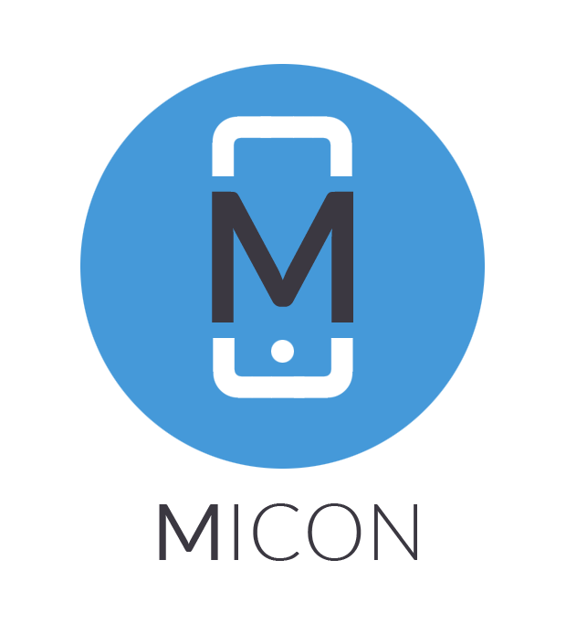
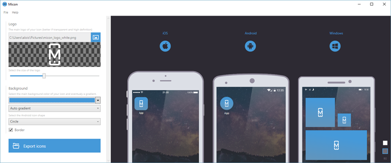

Micon is a small tool for generating quickly your mobile app icons.

## Downloads

[Windows](https://github.com/aloisdeniel/Micon/releases)

## Features

* Save and load your icon generation configuration
* Create icon from a transparent logo and background color
* Preview the result on light or dark background
* Export icons to all required sizes (Android,iOS)
* Different Android icon shapes
* Quick gradient suggestion or custom one, and border

## Roadmap

* Add Shortcuts
* Mac version 
* Separate settings for each target
* Generation from command line
* SVG support
* Improve image quality
* Improve auto gradient colors

## About

This WPF/[Xamarin](https://www.xamarin.com/) application has been initiated for testing out different frameworks : [ReactiveUI](http://reactiveui.net/), [Fody](https://github.com/Fody/Fody), [Autofac](https://autofac.org/), [Xamarin.Mac](https://developer.xamarin.com/guides/mac/).

After some experiments, the application seemed to be useful because of the lack of this type of application so I've decided to actually release it. Consequently, the quality of the code may not be the best I've produced... I apologize for this. Don't hesitate to participate or to make suggestions as github issues.

### License

MIT © [Aloïs Deniel](http://aloisdeniel.github.io)